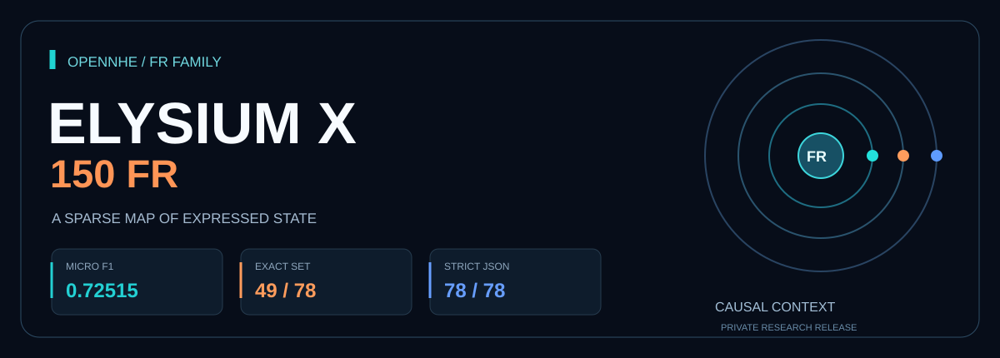
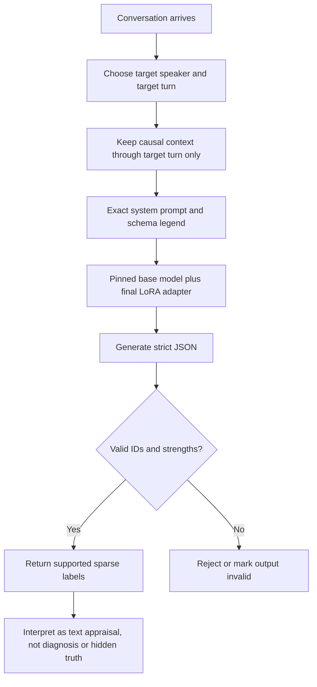
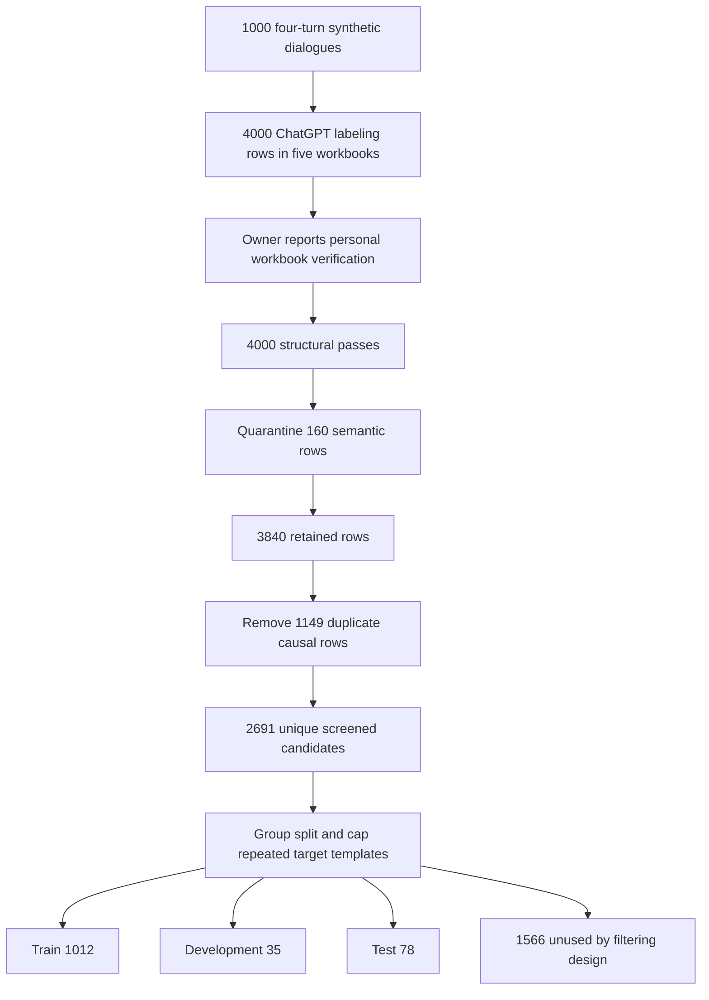
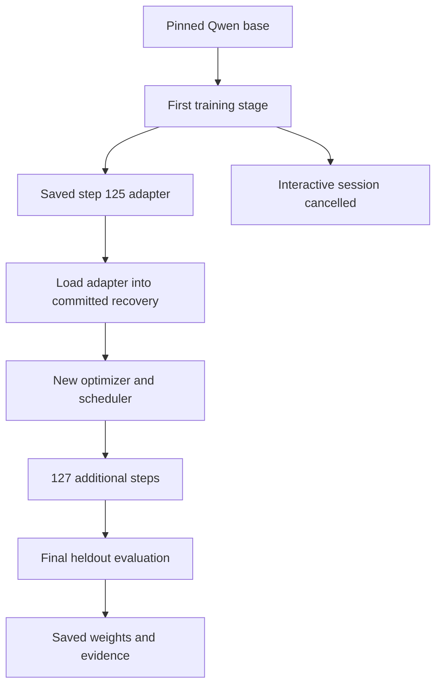
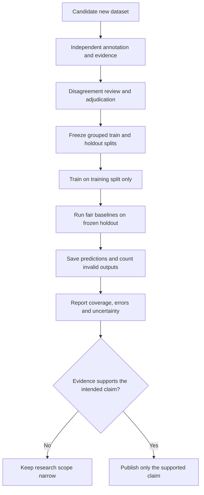

# Elysium X 150 FR
## The latest in the FR family series

**A plain-language guide to the model, the dataset, the training run, and what the result really means.**

Public research release by Pratham Prateek Mohanty / OpenNHE Technologies. Release documentation: October 3, 2026.

**Technical paper:** [Elysium X 150 FR: A Small LoRA Adapter for Sparse, Per-Speaker Emotion and Appraisal Labeling over a 150-Coordinate Schema](https://doi.org/10.5281/zenodo.23155240) (Zenodo preprint, DOI 10.5281/zenodo.23155240), Pratham Prateek Mohanty. Paper page with in-browser demo: [open-nhe/Elysium-X-150-FR-Paper](https://huggingface.co/spaces/open-nhe/Elysium-X-150-FR-Paper).

This guide describes the measured X150 FR release. It does not turn earlier X20-family results into X150 results, and it does not claim that FR has a particular expanded meaning unless the owner defines it. "Latest" describes this release in the project family, not a claim that it beats every earlier model on a fair benchmark.

## Navigation

[Start here](#start-here) · [What it does](#1-what-happens-when-the-model-reads-a-conversation) · [Dataset](#3-how-the-dataset-was-built) · [Training](#4-training-without-the-jargon-wall) · [Results](#5-understanding-the-scorecard) · [Use it](#7-how-to-use-the-model) · [All 150 labels](#10-full-150-coordinate-reference)

## Start here

Imagine two people talking. A sentence can show joy, worry, disappointment, pride, care, or several of these together. But the person speaking about worry may be describing somebody else's worry, or something that ended yesterday. Elysium X 150 FR is an experimental text model that tries to assign a small set of supported emotion and appraisal labels to **one specified speaker, at one specified moment**.

It is not a mind reader. It sees words and earlier conversation, not the person's actual private feelings. It should describe what is expressed in the available text. It cannot establish a diagnosis, intent, truthfulness, consent, or a reason to intervene.

The current release is a LoRA adapter built on Qwen2.5-1.5B-Instruct. Think of the base model as a general-purpose language engine and the adapter as a small set of extra trained controls that teaches it this project's output task. The adapter needs the base model; it is not a standalone replacement for it.

### The release in one view

| Item | Actual release |
|---|---|
| Base language model | Qwen/Qwen2.5-1.5B-Instruct, pinned revision |
| Task | Sparse state labels for a target speaker and turn |
| Product schema | 150 provisional coordinates in 10 families |
| Observed training language | English |
| Original labeling batch | 1,000 fictional four-turn dialogues / 4,000 target rows |
| Final training set | 1,012 filtered unique rows |
| Frozen development / test | 35 / 78 rows |
| Final JSON validity | 78/78 test outputs |
| Final micro-F1 | 0.725146 against reviewed synthetic labels |
| Exact full label-set match | 49/78, or 62.82% |
| Compute | Free Kaggle Tesla T4 |
| Visibility | X150 GitHub and Hugging Face repositories public |

### Repository map

- [Hugging Face model (public)](https://huggingface.co/open-nhe/Elysium-X-150-FR): actual weights, frozen datasets, predictions, metrics, historical checkpoints and release package.
- [GitHub repository (public)](https://github.com/itsppm76/Elysium-X-150-FR): project code/design, this guide, title-card assets and code/evidence reference.
- [Final evaluation checkpoint](https://huggingface.co/open-nhe/Elysium-X-150-FR/commit/6f27585af638531c2dabed110d0cc183b4b040d0): preserved complete-run snapshot.
- [Final adapter folder](https://huggingface.co/open-nhe/Elysium-X-150-FR/tree/main/chatgpt_batch_v2_recovery/adapter): LoRA configuration, safetensors and tokenizer files.
- [Full release code/audit package](https://huggingface.co/open-nhe/Elysium-X-150-FR/blob/main/1-FinalRelease_Code_Audit.zip): exact inference prompt, taxonomy, scripts, final predictions and audit reports.
- [Code and measured evidence](RELEASE_CODE_AND_EVIDENCE.md): readable source and final configuration on GitHub. Script data payload was externalized for readable presentation; no new run was performed.

Both repositories are public. No sign-in or access request is needed to read or download them. The labeled dataset is also public: https://huggingface.co/datasets/open-nhe/Elysium-X-150-FR-dataset (CC BY 4.0).

## 1. What happens when the model reads a conversation?

The input contains a conversation and the target to assess. The application must stop the visible conversation at that target turn. The model should not use later turns to decide how the person felt earlier.

Consider this **illustrative example, not a recorded model prediction**:

```json
{
  "turns": [
    {"index": 0, "speaker": "A", "text": "I got the scholarship. I cannot stop grinning."},
    {"index": 1, "speaker": "B", "text": "I am thrilled for you after all that waiting."}
  ],
  "target_turn": 0,
  "target_speaker": "A"
}
```

For this target, only turn 0 belongs in the actual causal input. Turn 1 is shown here to make the boundary clear: it must be removed before asking about A at turn 0. If the target were B at turn 1, both turns would be available, but the label would describe B, not A.

The output format is deliberately small:

```json
{"dimensions":[{"id":1,"strength":0.5}]}
```

ID 1 is joy in the project taxonomy. This example explains the format; it does not prove that a particular inference will produce this label or strength.



### Sparse output, explained

The model does not have to print all 150 labels. It returns only the labels it judges supported. This is called sparse output.

An omitted label is **unknown or unreported**, not a checked negative. If fear is missing, that does not prove the speaker is fearless. Likewise, `{"dimensions":[]}` means no supported label was returned under this task, not that the person is clinically neutral or that the conversation is safe.

### Strength is not confidence

Strength is the intensity expressed in the text. A provisional scale uses 0.25 for slight or qualified expression, 0.5 for clear moderate expression, 0.75 for strong expression, and 1.0 for unusually intense explicit expression. It is not the model's probability of being right. A strong label can still be wrong. The current trained output allows positive strengths greater than zero through one; the annotation protocol separately discusses zero only when a coordinate was explicitly reviewed for lack of support.

The small matched-label intensity error measured below does not establish calibration. A model can copy a teacher's preferred intensity values without measuring real human intensity accurately.

## 2. Why 150 coordinates?

The schema is a project design: a fixed vocabulary of 150 emotion, appraisal, need and stance coordinates. It is broader than a handful of basic emotion labels. It is not evidence that science has established 150 independent emotions, or that every pair is psychologically separate.

There are 10 families with 15 coordinates each. A family is a filing system, not a training label for the whole conversation. A fictional scenario designed around "Positive affect" can still contain disappointment or worry. Only the actual target evidence decides which labels are supported.

| Family | What it helps describe |
|---|---|
| Positive affect | Pleasant states such as joy, satisfaction and anticipation |
| Distress and loss | Painful states, loss-related appraisals and low affect |
| Threat and uncertainty | Worry, apprehension and uncertain outcomes |
| Opposition and injury | Resistance, grievance and feeling wronged |
| Bonding and care | Connection, concern and affiliative expression |
| Social appraisal | How recognition, standing and social evaluation are expressed |
| Knowledge and surprise | Discovery, confusion, unexpectedness and understanding |
| Agency and motivation | Goals, effort, choice and perceived ability to act |
| Regulation and readiness | Expressed settling, control and readiness states |
| Relational needs and repair | Belonging, boundaries, repair and interpersonal needs |

Definitions matter more than cue words. "I am proud of you" does not automatically mean the target claims pride in their own contribution. "I was terrified last year, but I am fine now" does not support current fear merely because the word "terrified" appears. A label about another person must not be assigned to the target.

The full 150-coordinate reference is in Section 10, including the insufficient-on-its-own rule for each coordinate.

## 3. How the dataset was built

### 3.1 Controlled fictional conversations

The new batch contained five chunks of 200 four-turn conversations each. Each chunk created 800 target-turn labeling rows. Across five chunks, that is 1,000 dialogues and 4,000 rows.

The conversations were controlled synthetic English text, not scraped private chats or 1,000 independent real-life interviews. Dialogue generation and labels are separate stages: the an AI wrote the dialogues from scenarios, then the owner ran the ChatGPT labeling workflow on five Excel sheets and personally reviewed and returned them.

There were 1,000 exact-unique dialogue texts but only 300 source scenario groups. The later chunks reused 200 episode leads across four emotional trajectories. Exact uniqueness is therefore not the same as full scenario independence. This is why grouping and target-template caps are important.

### 3.2 Target rows and evidence

Each row names a target speaker and target turn and provides only causal context. The labeling protocol requires exact target-speaker quotes, turn indices and a reason linking that evidence to the current state. Earlier text can explain the situation, but it cannot by itself prove that a past feeling continued.

The supplied rules ask for the smallest defensible label set. Similar words are not a reason to multiply overlapping coordinates. Sarcasm, quotation, roleplay, negation and other people's states require special care.

### 3.3 Owner review

On October 3, 2026, Pratham stated that he personally verified every returned Excel sheet. That is recorded as owner-reported personal review across all 1,000 dialogues of labels generated through the owner's ChatGPT workflow.

This review is part of the dataset provenance. It does not change which rows the training actually used, erase the known quarantines, or create an independent multi-annotator gold study. Such a study would separately record independent judgments, disagreements and adjudication. The existing result can honestly be described as agreement with the owner's reviewed synthetic teacher dataset.

### 3.4 Structural and semantic checks

All 4,000 rows passed the structural check: no blank or malformed returned units, no changed supplied contexts, and no missing expected rows. This says the spreadsheets were structurally usable. It does not mean all semantic labels were correct.

The semantic screen quarantined 160 whole rows. Examples of reasons include another speaker's agency mislabeled as the target's agency, a resolved worry treated as current, literal "empty room" interpreted as inner emptiness, and receiving care confused with expressing care. These are concrete evidence-attribution errors, not punctuation problems.

Next, 1,149 duplicate causal-input rows were removed. No conflicting annotations for identical causal inputs were found in this batch. That left 2,691 unique screened candidates.

### 3.5 Freeze the splits before measuring

A row-level random split would let different turns or variations of the same episode leak across train and test. Instead, the released split keeps source groups and exact target text disjoint. A maximum of four training contexts per repeated target template limits memorization pressure.

The final sets are:

| Set | Rows | Positive | Empty | Positive IDs represented | Source groups |
|---|---:|---:|---:|---:|---:|
| Train | 1,012 | 644 | 368 | 117 | 270 |
| Development | 35 | 33 | 2 | 20 | 10 |
| Test | 78 | 73 | 5 | 44 | 20 |

Another 1,566 screened candidates were not used because of the source-group/template-cap construction. They were not all errors. Development was frozen but was not used for model selection in this completed run.



The arithmetic is checkable: 4,000 - 160 - 1,149 = 2,691; 1,012 + 35 + 78 + 1,566 = 2,691.

## 4. Training, without the jargon wall

### Base model and adapter

Qwen2.5-1.5B-Instruct is the starting model. "1.5B" describes its approximate parameter scale; it is not the number of training examples in this project. The exact base revision was pinned so an upstream model change cannot silently alter the experiment.

LoRA trains additional low-rank weights rather than rewriting every base weight. QLoRA runs the base in a compact 4-bit representation during training to fit limited GPU memory. The adapter file is about 73.9 MB, much smaller than the full base model. Loading still requires the base weights and a compatible software/hardware environment.

### Actual configuration

| Setting | Value |
|---|---|
| Base revision | `989aa7980e4cf806f80c7fef2b1adb7bc71aa306` |
| LoRA rank | 16 |
| Learning rate | 0.0001 |
| Gradient accumulation | 8 |
| Random seed | 150 |
| Maximum input-plus-output token budget | 4,096 |
| Input guard | Reject prompts over 3,840 tokens; no silent truncation |
| Recovery training pass | 1 full additional epoch over 1,012 training rows |
| GPU | Tesla T4, free Kaggle run |

A token is a small piece of text, not necessarily a whole word. Gradient accumulation combines several small training examples before one optimizer update. An epoch is one pass over the chosen training set. Neither the seed nor the 150-coordinate vocabulary establishes accuracy by itself.

### First stage and cancellation

The first stage saved an adapter at 125 optimizer steps, after 1,000 example updates. The interactive Kaggle session later showed Cancelled. The record does not establish why it was cancelled. Calling it a confirmed timeout or a platform kill would go beyond the evidence.

### Recovery was a continuation, not a perfect resume

The committed recovery loaded the saved step-125 adapter. It did **not** restore the first stage's optimizer and scheduler. It started those afresh and trained for 127 more steps, or 1,012 additional example updates.

Together, the saved stages contain 252 optimizer steps and 2,012 example updates. This is not the same as two clean uninterrupted epochs. The recovery run completed in 48 minutes 44 seconds, and its final predictions and metrics were saved. The draft session was OFF after completion, with no active-job indicator.



No new training was performed during repository migration or documentation creation. Moving a model into an organisation does not improve or reduce its score.

## 5. Understanding the scorecard

The same frozen 78-row test was used for the untouched base, the saved first-stage adapter and the final continuation. Its hash is:

`71268f311212692113ac0d9b4eb6c2783118425e049c543d26ffb15f554bbb62`

A hash is a file fingerprint: it helps check that the test file did not change between runs.

| Metric | Untouched base | Step-125 adapter | Final continuation |
|---|---:|---:|---:|
| Micro-F1 vs owner-reviewed labels (ChatGPT-generated) | 0.0000 | 0.65896 | 0.72515 |
| Exact label-set match | 0/78 | 47/78 | 49/78 |
| Strict JSON validity | 0/78 | 78/78 | 78/78 |
| Nonempty parsed predictions | 0/78 | 73/78 | 71/78 |

The base result is an observed failure under this prompt, parser and test, not a claim that Qwen is useless for all emotion tasks.

### Partial-credit agreement: micro-F1

Suppose the reference says joy and relief, while the model says joy and pride. Joy is a correct positive label. Pride is an extra label, and relief is missing. A partial-credit measure records all three outcomes instead of treating the row as entirely correct.

The final result had 62 true-positive labels, 19 false-positive labels and 28 false-negative labels. Micro-F1 is `2*TP / (2*TP + FP + FN)`, so `124 / 171 = 0.725146`. "Micro" means the label counts are combined across the test before computing the score.

**0.72515 F1 does not mean the model correctly judges people 72.5% of the time.** It is agreement with these reference label sets. The actual whole-set exact score is 49/78, or 62.82%.

### Exact agreement and format validity

Exact agreement requires the predicted label-ID set to match the reference set for that row. It does not require identical strength values. Final positive-only exact agreement was 44/73; all five teacher-empty rows were matched.

Strict JSON validity means the parser accepted the required structure, IDs and strengths. It does not establish semantic correctness. A perfectly formatted wrong label is still wrong.

### More results, and their limits

- Macro-F1 across the 44 teacher-supported test IDs: 0.70832. Macro averages give each included ID a voice; IDs not represented in the test are not validated by that number.
- Matched-label strength MAE: 0.01613. MAE is average absolute difference for labels matched between prediction and teacher. It omits unmatched-label intensity and is not general calibration.
- Tesla T4 latency: median 2.576 seconds; 95th percentile 4.005 seconds for this test configuration. No phone, CPU, other GPU or production-serving speed claim is made.
- Last 40 training-loss average: 0.071845. Loss is the internal training fit measure; it is not the same as emotion accuracy.
- Final F1 increased by about 0.06619 from the saved first-stage adapter on this test. The same test was observed more than once, so later model-development claims should use a fresh holdout rather than repeatedly optimizing to these 78 rows.

The recovery `comparison.json` uses the historical key `base` to mean the loaded step-125 adapter. It is not the untouched model. The untouched baseline is in the separate original `chatgpt_batch_v2/base_metrics.json`.

## 6. What is ready, and what is not?

**Ready in this release:** public downloadable adapter, reproducible pinned base identity, documented input/output contract, frozen dataset evidence, saved predictions, measured test results and honest provenance.

**Not established:** independently annotated natural-chat accuracy, full-150 coverage, Hindi/Hinglish or other-language quality, population validity, intensity calibration, crisis reliability, bias/fairness, adversarial robustness, or deployment readiness.

Training contains positive examples for 117 IDs. Test labels cover 44 IDs, including three IDs not positively represented in training: 122, 138 and 143. A successful result on those few rows does not prove general zero-shot performance for every uncovered coordinate.

The test contains 73 positive rows and only five empty rows. That class balance limits what can be said about reliable abstention in broad real-life use. Controlled templates also limit generalization. The semantic screen is conservative but does not certify every retained label.

Never use these labels alone for medical, employment, educational, insurance, policing or safety-critical decisions. Do not use an output as permission to contact someone, write a memory, make a commitment, or override the person's own account of how they feel.

## 7. How to use the model

### Step A: get access and the right files

Download or load the pinned base and adapter. Do not put tokens into notebook cells, source files or shared screenshots. Use your environment's supported secret mechanism and keep credentials outside the code.

The full inference contract lives in the HF release ZIP as `release/inference_contract.txt`. It contains the **exact** final system prompt, with all ID/name pairs. The reference definitions in Section 10 are the full labeling definitions, not a substitute for that exact training prompt. The trained prompt uses the compact ID/name legend to fit the context budget.

### Step B: install a compatible environment

The code uses PyTorch, Transformers, PEFT and Hugging Face Hub. The training route also used bitsandbytes and Kaggle Secrets. Install compatible versions for your platform. This release documentation does not claim a separately validated version matrix or a tested production server.

Loading the unquantized base on CPU is possible in principle but not benchmarked here; memory and speed depend on your environment. Use a supported GPU/quantization setup if needed. Do not assume the 73.9 MB adapter size is the total runtime memory requirement.

### Step C: load the pinned pair

This is a minimal loading and inference example, not a claim that this documentation reran inference in your environment:

```python
import json
from pathlib import Path
import torch
from transformers import AutoTokenizer, AutoModelForCausalLM
from peft import PeftModel

BASE = "Qwen/Qwen2.5-1.5B-Instruct"
BASE_REV = "989aa7980e4cf806f80c7fef2b1adb7bc71aa306"
MODEL = "open-nhe/Elysium-X-150-FR"
FINAL = "6f27585af638531c2dabed110d0cc183b4b040d0"

tokenizer = AutoTokenizer.from_pretrained(BASE, revision=BASE_REV)
base = AutoModelForCausalLM.from_pretrained(BASE, revision=BASE_REV)
model = PeftModel.from_pretrained(
    base, MODEL,
    subfolder="chatgpt_batch_v2_recovery/adapter",
    revision=FINAL,
)
model.eval()

# Copy ONLY the exact prompt text from release/inference_contract.txt.
# Do not include the explanatory preface or usage notes around it.
SYSTEM = Path("exact_system_prompt.txt").read_text()
payload = {
    "turns": [
        {"index": 0, "speaker": "A", "text": "I got the scholarship. I cannot stop grinning."}
    ],
    "target_turn": 0,
    "target_speaker": "A",
}
messages = [
    {"role": "system", "content": SYSTEM},
    {"role": "user", "content": json.dumps(payload, ensure_ascii=False)},
]
inputs = tokenizer.apply_chat_template(
    messages, tokenize=True, add_generation_prompt=True,
    return_tensors="pt",
)
if inputs.shape[-1] > 3840:
    raise ValueError("Input exceeds the release prompt budget")
inputs = inputs.to(model.device)
with torch.inference_mode():
    outputs = model.generate(
        inputs, max_new_tokens=256, do_sample=False,
        pad_token_id=tokenizer.eos_token_id,
    )
raw = tokenizer.decode(outputs[0, inputs.shape[-1]:], skip_special_tokens=True)
result = json.loads(raw)  # Raises if invalid; do not silently repair for scoring.
print(result)
```

### Step D: validate and interpret

Check that the object contains only the expected `dimensions` list, each item has a unique integer ID in 1..150 and a numeric strength greater than zero and at most one, and no extra narrative text is treated as a successful structured answer. Map IDs to the frozen taxonomy. For evaluation, count invalid outputs as exact failures; do not hide them by repairing the answer and scoring it as original output.

The caller should reject future-turn leakage, wrong-target payloads and oversized prompts before inference. A later application may use whole-turn context budgeting, but it should not silently change this release's tested format or claim the same scores without re-evaluation.

## 8. Reproduce or extend the work carefully

1. Keep an immutable copy of the datasets, taxonomy, base revision and exact prompt.
2. Verify the frozen test hash before comparing.
3. Load the same starting adapter or untouched base for the intended comparison. Name it clearly.
4. Use the same parser and report invalid outputs, not just successful ones.
5. Preserve source grouping and target-text disjointness. Do not split sibling templates randomly across sets.
6. Record compute, decoding, training settings and whether optimizer state was restored.
7. Save row-level predictions before summarizing metrics. Aggregate counts can then be independently recounted.
8. For a stronger next claim, build a new naturalistic independent human-annotated holdout, with disagreement/adjudication records, stronger empty/uncertain cases and explicit language/coordinate coverage.



This diagram describes a **recommended future evaluation workflow**, not work already completed in this release.

## 9. Rights, release scope and common questions

Original X150 project contributions are proprietary, All Rights Reserved, Pratham Prateek Mohanty. The Qwen2.5 base is Apache-2.0 and retains its own license and notices. Third-party materials retain their applicable terms. Making the repository public does not remove an upstream license obligation. The labeled dataset is released separately under CC BY 4.0; the model, code and documentation keep the rights stated above.

The older non-FR X20 model remains public under its existing MIT card, by the owner's choice. That does not make X150 MIT. The public X150 repositories, the X20-FR repository and the public X20 now sit under the OpenNHE organisation.

**Is it trained on all 4,000 rows?** No. The returned batch has 4,000 rows; the final training split has 1,012 after screening, deduplication, grouping and caps.

**Is the model 72.5% accurate at understanding humans?** No such general accuracy result exists. Its micro-F1 agreement is 0.72515 on 78 controlled reference rows, with 49 exact label-set matches.

**Did the owner check the labels?** He stated that he personally verified all Excel sheets. The labels were generated through his ChatGPT workflow and personally reviewed by him across all 1,000 dialogues (owner-reported review); this is not an independent annotation study.

**Does 150 mean 150 emotions were all learned?** No. It is the schema size. There are 117 positive training IDs and 44 teacher-supported test IDs.

**Can it handle Hindi or Hinglish?** That is not validated by this release. The measured final batch is English.

**Is a valid JSON answer necessarily right?** No. Format and label correctness are separate.

**What did migration change?** Ownership namespace and access management, not weights or measured results. Existing HF history was preserved.

**Why not silently call the recovery two epochs?** The optimizer/scheduler restarted after a saved adapter. Exact provenance matters when reproducing a result.

**Why are code and audit files in different places?** GitHub binary file-upload commits failed during publication. The full ZIP is on the public HF repository; GitHub has readable text source and evidence links. No failed ZIP is presented as available.

<details>
<summary>Open the full 150-coordinate reference</summary>

## 10. Full 150-coordinate reference

The following is the frozen experimental v0.2 design reference. "Insufficient on its own" warns against a common overinterpretation; it is not a ban on co-occurrence when separate evidence supports both states.


### Positive affect

| ID | Coordinate | What it means in this schema | Insufficient on its own |
|---:|---|---|---|
| 1 | joy | Pleasure or happiness about the current situation. | Mere politeness or agreement. |
| 2 | contentment | Satisfaction with the present state without seeking change. | High-energy excitement alone. |
| 3 | amusement | Finding something funny or playfully entertaining. | Mockery without expressed enjoyment. |
| 4 | excitement | Energized positive anticipation or engagement. | Pleasure with no activation cue. |
| 5 | delight | Pleasurable surprise at a specific welcome detail or event. | Generic happiness without a specific welcome cause. |
| 6 | elation | Unusually elevated exuberant happiness. | Ordinary moderate pleasure. |
| 7 | serenity | Peaceful positive ease with little internal conflict. | A controlled tone that hides tension. |
| 8 | relief | Reduced distress after a feared burden or outcome eases. | Hope that a burden might ease later. |
| 9 | hope | A wanted future outcome still feels possible. | Certainty that it will happen. |
| 10 | optimism | A broadly favorable expectation for what comes next. | Desire without favorable expectation. |
| 11 | gratitude | Thankfulness for a benefit, kindness or help received. | Routine thanks without a discernible appreciative stance. |
| 12 | pride | Positive evaluation of one's own action, achievement or group contribution. | Praise of someone else's achievement alone. |
| 13 | admiration | Positive regard for another's qualities or achievement. | Simple agreement with their opinion. |
| 14 | awe | Feeling impressed or small before something perceived as vast or exceptional. | A routine surprise. |
| 15 | inspiration | Feeling moved toward possibility or action by an example or experience. | Admiration with no motivating effect. |

### Distress and loss

| ID | Coordinate | What it means in this schema | Insufficient on its own |
|---:|---|---|---|
| 16 | sadness | Unpleasant low mood about an adverse situation or loss. | A merely negative evaluation with no felt distress. |
| 17 | grief | Distress linked to losing an important person, relationship or life possibility. | An ordinary setback without important loss. |
| 18 | sorrow | Reflective pain or lament about suffering or loss. | Brief annoyance. |
| 19 | loneliness | Unwanted lack of companionship or felt connection. | Choosing enjoyable solitude. |
| 20 | emptiness | A felt inner absence, hollowness or lack of emotional meaning. | Boredom without an inner-absence cue. |
| 21 | disappointment | A valued expectation did not turn out as wanted. | A negative event without an expectation contrast. |
| 22 | discouragement | A setback reduces willingness or confidence to continue. | Sadness with motivation unchanged. |
| 23 | despair | Severe distress with a felt lack of a way forward. | A mild discouraging setback. |
| 24 | helplessness | Feeling unable to change or escape an unwanted current situation. | Not knowing what will happen alone. |
| 25 | hopelessness | Feeling that a wanted future improvement is not possible. | Temporary uncertainty about one plan. |
| 26 | regret | Wishing a past choice or event had gone differently. | Current dissatisfaction without a counterfactual past wish. |
| 27 | remorse | Pain about harm one believes one caused, with a wish to make amends. | Regret over personal inconvenience alone. |
| 28 | guilt | Feeling responsible for violating a duty or harming someone. | Being accused without accepting responsibility. |
| 29 | shame | A negative appraisal of oneself as exposed, unworthy or flawed. | Regret about a discrete mistake without self-directed devaluation. |
| 30 | embarrassment | Self-conscious discomfort about a socially awkward exposure. | Deep self-devaluation without an awkward exposure cue. |

### Threat and uncertainty

| ID | Coordinate | What it means in this schema | Insufficient on its own |
|---:|---|---|---|
| 31 | fear | Distress about a specific perceived threat or danger. | A future uncertainty with no threat cue. |
| 32 | anxiety | Sustained apprehensive arousal about uncertain adverse possibilities. | Calm uncertainty. |
| 33 | nervousness | Mild or moderate uneasy arousal in a demanding imminent situation. | A vague belief that a bad outcome is possible without felt arousal. |
| 34 | apprehension | Uneasy anticipation of a specific upcoming adverse possibility. | Surprise after an event. |
| 35 | worry | Repeated concern or thought about a possible problem. | A single neutral question about risk. |
| 36 | dread | Strong aversion while anticipating an expected distressing event. | Ordinary mild nervousness. |
| 37 | panic | Sudden intense fear with a felt loss of composure or control. | Any strong fear without abrupt overwhelming expression. |
| 38 | insecurity | Doubt about one's adequacy, worth or relational standing. | Uncertainty about external facts alone. |
| 39 | vulnerability | Feeling exposed to emotional harm or openly at risk. | Being objectively at risk without a felt-exposure cue. |
| 40 | unease | Diffuse discomfort that something feels wrong or unsafe. | Neutral unfamiliarity. |
| 41 | suspicion | A tentative concern that another's motives or an account are concealed or adverse. | Verified knowledge of wrongdoing alone. |
| 42 | distrust | An expressed unwillingness to rely on someone or their claims. | A question asking for clarification. |
| 43 | uncertainty | An expressed lack of a settled answer or prediction. | Not wanting to reveal an answer one already knows. |
| 44 | overwhelm | Demands or feelings feel too much to handle together. | Being busy without reduced handling capacity. |
| 45 | stress | Felt pressure from demands, stakes or constraints. | A demanding situation reported without personal strain. |

### Opposition and injury

| ID | Coordinate | What it means in this schema | Insufficient on its own |
|---:|---|---|---|
| 46 | anger | Hostile activated displeasure about an offense or obstruction. | A calm negative judgment alone. |
| 47 | annoyance | Mild displeasure at a bothersome event or behavior. | High-intensity rage. |
| 48 | frustration | Displeasure because progress, a goal or a need is blocked. | General hostility without an obstruction. |
| 49 | irritation | Short-tempered sensitivity to a bothersome stimulus. | A considered moral objection alone. |
| 50 | resentment | Continuing displeasure over perceived unfair treatment or an unmet obligation. | A momentary irritation with no remembered grievance. |
| 51 | bitterness | Lingering hardened negativity after repeated hurt or disappointment. | Fresh sadness without a hardened stance. |
| 52 | indignation | Anger at a perceived unfair or improper act. | A personal inconvenience with no fairness judgment. |
| 53 | outrage | Intense anger at a perceived serious moral violation. | Mild disagreement about appropriateness. |
| 54 | disgust | Strong aversion or repulsion toward something perceived as offensive or contaminating. | Simple disapproval. |
| 55 | contempt | Dismissing someone or something as beneath respect. | Anger that still treats the other as worthy of respect. |
| 56 | envy | Pain or desire about an advantage another has that one lacks. | Fear of losing an existing relationship to a rival. |
| 57 | jealousy | Threat or distress about losing valued relational attention to a rival. | Wanting someone else's possession alone. |
| 58 | humiliation | Feeling degraded or publicly diminished by another or a social event. | Private awkwardness without degradation. |
| 59 | betrayal | Feeling that someone violated an important trust or loyalty. | Unexpected behavior without a trust expectation. |
| 60 | hurt | Emotional pain from a perceived interpersonal wound or rejection. | Physical pain alone. |

### Bonding and care

| ID | Coordinate | What it means in this schema | Insufficient on its own |
|---:|---|---|---|
| 61 | affection | A warm positive feeling toward a person or being. | Practical help without a warm feeling cue. |
| 62 | love | An explicit or strongly evidenced enduring valued bond and care. | A casual like or generic friendly politeness. |
| 63 | tenderness | Gentle protective warmth toward another's vulnerability. | General attraction without gentleness. |
| 64 | compassion | Concern for another's suffering with an inclination to ease it. | Understanding their perspective with no concern. |
| 65 | empathy | Expressed felt understanding or resonance with another's experience. | Advice or agreement alone. |
| 66 | caring | Concern for another's well-being and wish to attend to it. | Social courtesy without concern. |
| 67 | warmth | Friendly emotional openness and a welcoming positive tone toward someone. | Formal politeness alone. |
| 68 | fondness | Gentle liking grounded in familiarity or affectionate regard. | Strong dependency or fear of loss alone. |
| 69 | attachment | Feeling an emotionally important tie and pull to remain linked. | Enjoying one interaction without an important tie. |
| 70 | belonging | Feeling included and at home in a relationship or group. | Being physically present without inclusion. |
| 71 | acceptance | Feeling received without needing to conceal or change a salient part of oneself. | Agreeing with a proposal. |
| 72 | trust | Willingness to rely on another's goodwill, honesty or reliability. | Mere absence of a complaint. |
| 73 | emotional_closeness | A felt mutual understanding and accessible emotional bond. | Physical proximity or frequent contact alone. |
| 74 | intimacy | Valued private personal sharing or vulnerability within a close bond. | Explicit sexual content or physical contact alone. |
| 75 | solidarity | Felt alliance with another or a group through shared commitment or adversity. | A shared preference with no alliance. |

### Social appraisal

| ID | Coordinate | What it means in this schema | Insufficient on its own |
|---:|---|---|---|
| 76 | approval | A positive evaluative stance toward a specific action or choice. | Pleasure unrelated to evaluation. |
| 77 | disapproval | A negative evaluative stance toward a specific action or choice. | Distress without a judgment of the action. |
| 78 | respect | Recognizing another's dignity, boundaries or competence as worthy of regard. | Fearful compliance alone. |
| 79 | disrespect | Feeling or expressing that dignity, boundaries or worth were disregarded. | An ordinary disagreement without disregard. |
| 80 | appreciation | Noticing and valuing a quality, effort or contribution. | Generic positive mood. |
| 81 | feeling_seen | Feeling that another accurately noticed an important part of one's experience. | Receiving attention that misreads the experience. |
| 82 | feeling_unheard | Feeling that one's expressed concern or meaning was not listened to. | A message not yet answered without a listening judgment. |
| 83 | validation | Feeling that one's experience or reaction is acknowledged as understandable. | Being told one's factual claim is correct alone. |
| 84 | invalidation | Feeling that one's experience is dismissed, minimized or denied legitimacy. | A factual correction that acknowledges the feeling. |
| 85 | rejection | Feeling refused as a person, partner or wanted participant. | A logistical no with no felt personal refusal. |
| 86 | exclusion | Feeling left out of a desired group activity or social space. | Choosing not to participate. |
| 87 | social_comparison | Evaluating one's own standing by contrasting it with another's. | Mentioning another's achievement without self-comparison. |
| 88 | status_threat | Concern that one's social standing, competence reputation or rank is at risk. | A loss unrelated to standing. |
| 89 | dignity | A felt claim to intrinsic worth and treatment consistent with it. | Pride in a specific achievement alone. |
| 90 | recognition | Feeling that a contribution, identity or achievement has been acknowledged. | Being visible without acknowledgement of value. |

### Knowledge and surprise

| ID | Coordinate | What it means in this schema | Insufficient on its own |
|---:|---|---|---|
| 91 | curiosity | Wanting to find out something not yet known. | A rhetorical question expressing criticism. |
| 92 | interest | Sustained attention or attraction toward a topic, activity or person. | A neutral mention without engagement. |
| 93 | confusion | Difficulty making sense of available information or what to do. | Uncertainty with a clear understanding of the options. |
| 94 | surprise | An immediate reaction to something not expected. | A predictable welcome event. |
| 95 | astonishment | Strong surprise at an unusually unexpected event. | Mild ordinary surprise. |
| 96 | bewilderment | Marked confusion after expectations or sense-making break down. | A simple request for one missing fact. |
| 97 | realization | An expressed newly reached insight or recognition. | Restating an already-held belief. |
| 98 | understanding | A felt grasp of meaning, reasons or a perspective. | Claiming agreement without grasping the reason. |
| 99 | doubt | Questioning whether a belief, choice or claim is right. | Not yet receiving information without questioning anything. |
| 100 | skepticism | A critical reluctance to accept a claim without more support. | A general distrust of a person without a claim under review. |
| 101 | certainty | Feeling settled or sure about a proposition or outcome. | Strong desire that it be true. |
| 102 | wonder | Open reflective fascination at something that invites exploration. | Simple surprise with no reflective fascination. |
| 103 | cognitive_conflict | Feeling torn between incompatible beliefs or interpretations. | Competing practical goals without conflicting beliefs. |
| 104 | disbelief | Difficulty accepting that a reported or observed event is true. | A question asked only to obtain a missing detail. |
| 105 | expectation_violation | An expressed mismatch between a prior expectation and what occurred. | Surprise without an identifiable prior expectation. |

### Agency and motivation

| ID | Coordinate | What it means in this schema | Insufficient on its own |
|---:|---|---|---|
| 106 | desire | An expressed wanting of an outcome, object or experience. | A plan with no personal wanting cue. |
| 107 | longing | A sustained felt lack and wish for an absent valued thing or person. | A brief preference for an available option. |
| 108 | yearning | Intense emotionally charged longing for connection or fulfillment. | Mild wanting. |
| 109 | determination | Strong willingness to persist despite difficulty. | Excitement without a persistence cue. |
| 110 | resolve | A settled commitment to a course after deliberation or doubt. | An undecided intention. |
| 111 | motivation | Felt readiness or drive to pursue an activity or goal. | A goal stated without willingness to act. |
| 112 | ambition | Desire to achieve a substantial future accomplishment or standing. | Completing a routine required step. |
| 113 | confidence | Positive assurance about oneself or a coming action. | Certainty about an external fact alone. |
| 114 | self_efficacy | Belief in one's ability to perform a particular task or handle a challenge. | Generic self-worth. |
| 115 | agency | Feeling able to initiate choices and influence one's course. | An action imposed entirely by others. |
| 116 | powerlessness | Feeling deprived of effective influence over a valued situation or decision. | A freely chosen delegation. |
| 117 | perceived_control | Feeling that outcomes or important aspects are within one's influence. | A desire to control without feeling able to. |
| 118 | autonomy | Feeling or seeking freedom to choose according to one's own preferences. | Control over others. |
| 119 | defiance | Expressed resistance to an imposed demand, authority or constraint. | A quiet independent choice without opposition. |
| 120 | resignation | Giving up resistance and accepting an unwanted outcome as inevitable. | Willing positive acceptance. |

### Regulation and readiness

| ID | Coordinate | What it means in this schema | Insufficient on its own |
|---:|---|---|---|
| 121 | calmness | Low agitation and steady emotional arousal in the current situation. | Polite wording while explicitly agitated. |
| 122 | agitation | Restless or unsettled activated distress. | Purposeful energetic excitement. |
| 123 | tension | A felt tautness, strain or difficulty relaxing. | A difficult situation with no felt strain cue. |
| 124 | restlessness | Difficulty staying settled, waiting or remaining still. | Purposeful movement without unsettled feeling. |
| 125 | emotional_fatigue | Feeling depleted by sustained emotional demands. | Physical tiredness alone. |
| 126 | composure | Maintaining or regaining self-command despite emotional pressure. | A lack of pressure with ordinary calmness. |
| 127 | patience | Willingness to tolerate delay, difficulty or another's pace. | No delay or difficulty being described. |
| 128 | impatience | Difficulty tolerating delay or wanting progress faster. | Urgency imposed by a deadline without personal intolerance. |
| 129 | defensiveness | A protective response against perceived criticism or exposure. | A clear correction offered without self-protection. |
| 130 | openness | Willingness to consider a view, experience or personal exchange. | Uncritical agreement alone. |
| 131 | guardedness | Cautious withholding of emotion or information to protect oneself. | Simply having nothing relevant to share. |
| 132 | emotional_numbness | An expressed reduced ability to feel or emotional disconnection. | Calmness or absence of a label. |
| 133 | emotional_recovery | A felt movement back toward steadiness after emotional difficulty. | A hopeful plan to recover later. |
| 134 | willingness_to_engage | Readiness to participate in a current conversation or emotional exchange. | Being present without willingness. |
| 135 | withdrawal | A current pull to reduce interaction or disengage from emotional contact. | A brief break for unrelated logistics. |

### Relational needs and repair

| ID | Coordinate | What it means in this schema | Insufficient on its own |
|---:|---|---|---|
| 136 | reassurance_seeking | Seeking confirmation that a feared relational or personal concern is not true. | A factual question unrelated to reassurance. |
| 137 | support_seeking | Asking for practical or emotional help with a difficulty. | Mentioning difficulty without seeking help. |
| 138 | comfort_seeking | Seeking soothing, care or solace for emotional pain. | Seeking only factual information. |
| 139 | connection_seeking | Seeking renewed or increased meaningful contact or companionship. | Coordinating a purely logistical exchange. |
| 140 | distance_seeking | Seeking space or less closeness to protect a need or regulate contact. | Being geographically distant involuntarily. |
| 141 | boundary_assertion | Expressing a limit on access, behavior or responsibility one will accept. | A preference with no limit communicated. |
| 142 | boundary_discomfort | Unease about a personal limit being crossed or hard to state. | General relational worry without a limit cue. |
| 143 | fear_of_abandonment | Fear that an important other will leave or cease caring. | Missing someone with no feared departure. |
| 144 | dependency_concern | Concern about relying too heavily on another or being relied on excessively. | Ordinary valued mutual support. |
| 145 | reciprocity_expectation | Wanting mutual effort, attention or care in a relationship. | A request for help without a mutuality expectation. |
| 146 | forgiveness | A willingness to release a grievance toward someone who caused hurt. | Pretending harm did not occur or accepting future harm. |
| 147 | reconciliation_desire | Wanting to restore a relationship after conflict or separation. | Missing a person without wanting renewed relationship. |
| 148 | conflict_repair | Current effort or readiness to address damage from a disagreement. | Ending a conversation without addressing the damage. |
| 149 | relational_ambivalence | Simultaneous incompatible pulls toward and away from a relationship. | Simple uncertainty about a logistical plan. |
| 150 | self_disclosure_readiness | Willingness to reveal personally meaningful feelings or information. | Sharing impersonal facts alone. |

</details>

## Evidence index

The release numbers above are grounded in the frozen split audit, final run configuration, final row-level predictions and independently recounted final metrics. Original spreadsheets and earlier audit flags are retained as provenance; the later owner review statement is recorded without rewriting historical file flags into independent-gold claims.

- Frozen taxonomy: `docs/taxonomy-v0.2.json`, with 150 definitions.
- Dataset audit: `release/structural_report.json` and `release/semantic_report.json` in the HF package.
- Final metrics/predictions: `chatgpt_batch_v2_recovery/adapter_metrics.json` and `adapter_predictions.json` on HF.
- Run settings: `chatgpt_batch_v2_recovery/run_config.json` on HF.
- Training stages and baseline interpretation: final checkpoint and `RELEASE_CODE_AND_EVIDENCE.md`.

No new benchmark, paid compute, external sharing or retraining was required for this guide.

