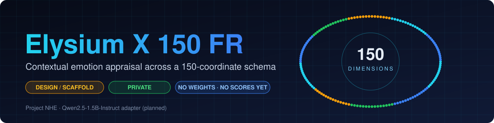

<p align="center"></p>

# Elysium X 150 FR

Private research release by Pratham Prateek Mohanty, OpenNHE Technologies.

A trained LoRA adapter on pinned Qwen2.5-1.5B-Instruct for sparse, per-speaker emotion/appraisal JSON across a provisional 150-coordinate schema. This is a measured English synthetic-data release, not a claim of SOTA, independently validated psychology, multilingual performance, or deployment readiness.

## Final adapter and loading

Final weights: `chatgpt_batch_v2_recovery/adapter` in this repository. The preserved final training/evaluation commit is `6f27585af638531c2dabed110d0cc183b4b040d0`. Prior adapters and diagnostic runs are retained as history, not promoted as the final model.

```python
from transformers import AutoTokenizer, AutoModelForCausalLM
from peft import PeftModel

base = "Qwen/Qwen2.5-1.5B-Instruct"
revision = "989aa7980e4cf806f80c7fef2b1adb7bc71aa306"
tokenizer = AutoTokenizer.from_pretrained(base, revision=revision)
model = AutoModelForCausalLM.from_pretrained(base, revision=revision)
model = PeftModel.from_pretrained(
    model, "open-nhe/Elysium-X-150-FR",
    subfolder="chatgpt_batch_v2_recovery/adapter",
    revision="6f27585af638531c2dabed110d0cc183b4b040d0",
)
```

Authenticate separately with an account permitted to read this private repository. Do not put access tokens in notebooks or source files. Use the exact system prompt and causal input format documented in `release/inference_contract.txt`. The model emits `{"dimensions":[{"id":1,"strength":0.5}]}` with IDs 1..150 and expressed intensity >0..1. An empty list means no supported label was returned, not verified neutrality. Omitted coordinates are unknown, not proven absent.

## Data and human review

The original batch contains 1,000 four-turn controlled fictional English dialogues and 4,000 target-turn labeling rows. Labels were generated using ChatGPT. On October 3, 2026, the owner stated that he personally verified all returned Excel sheets. This is recorded as owner-reported human review of AI-generated labels, not independent human-gold annotation or proof that every label is correct.

All 4,000 returned rows passed structural, unchanged-context and exact causal target-speaker quote checks. A conservative semantic screen quarantined 160 whole rows. Identical causal inputs removed another 1,149 duplicate rows; no identical-input label conflicts were found. The remaining 2,691 unique candidates were filtered by source grouping and a maximum of four training contexts per repeated target template.

Actual frozen split: 1,012 training rows (644 positive, 368 empty), 35 development rows, 78 test rows (73 positive, 5 empty). The development set was reserved but not used for model selection. Another 1,566 screened candidates were unused by grouping/template cap. Training did not use all 4,000 rows. Source groups and exact target text are disjoint between train, development and test. The data still uses controlled templates and is not 1,000 independent natural-chat scenarios.

Training supports 117 positive coordinate IDs. Test labels cover 44 IDs, including three test-only IDs (122, 138, 143). The product schema has 150 IDs; that is not evidence of measured competence across all 150.

## Actual evaluation

Same frozen 78-row test, SHA-256 `71268f311212692113ac0d9b4eb6c2783118425e049c543d26ffb15f554bbb62`.

| Metric | Untouched base | Saved step-125 adapter | Final continuation |
|---|---:|---:|---:|
| Micro-F1 against reviewed ChatGPT labels | 0.0000 | 0.6590 | 0.7251 |
| Exact label-set agreement | 0/78 | 47/78 | 49/78 (62.82%) |
| Strict JSON schema | 0/78 | 78/78 | 78/78 |
| Nonempty predictions | 0/78 parsed | 73/78 | 71/78 |

Final TP=62, FP=19, FN=28. Macro-F1 over the 44 teacher-supported test IDs: 0.7083. Positive-only exact agreement: 44/73. All five teacher-empty test rows were matched. The all-empty reference has zero positive-label F1 and only 5/78 exact matches.

**0.7251 is micro-F1, not the percentage of conversations judged correctly.** Exact label-set agreement is 62.82%. Metrics quantify agreement with this reviewed synthetic teacher dataset, not general emotion accuracy.

Matched-label intensity MAE: 0.0161. This is teacher-label agreement, not validated intensity calibration. Tesla T4 latency: median 2.576s, 95th percentile 4.005s for these inputs and settings. No device-general speed claim.

## Training provenance

Pinned base revision: `989aa7980e4cf806f80c7fef2b1adb7bc71aa306`. QLoRA rank 16, learning rate 0.0001, gradient accumulation 8, seed 150, maximum input-plus-output budget 4096 tokens.

First stage saved 125 optimizer steps / 1,000 example updates before the interactive session was cancelled. Continuation loaded that adapter with a new optimizer/scheduler, then completed 127 steps / 1,012 updates. This was not an exact uninterrupted resume. Recovery checkpoints include optimizer, scheduler and scaler state. The committed free-GPU run completed in 48 minutes 44 seconds.

The recovery `comparison.json` retains a historical key `base` for the loaded step-125 adapter. It is not the untouched base. The separate original `chatgpt_batch_v2/base_metrics.json` contains that baseline. Final predictions and their aggregate counts were independently recounted.

## Contents

- `chatgpt_batch_v2_recovery/adapter`: final adapter and tokenizer files.
- `chatgpt_batch_v2_recovery/`: final metrics, predictions, comparison, curve, run configuration, frozen splits and recoverable training state.
- `release/`: audit, inference contract and release scope.
- `chatgpt_batch_v2/`: earlier checkpoint and untouched-base results.
- Other directories: historical pilot/anchor evidence, with their own limits.

GitHub code and release notes: https://github.com/itsppm76/Elysium-X-150-FR

## Limits and safety

Appraise expressed text for only the target speaker at the target turn. Never leak future turns, attribute another speaker's state to the target, or treat a negated/resolved state as current. Labels are not diagnosis, consent, intent, safety decisions or permission to write memories or make commitments. No clinical or crisis decisions should depend on this model. Do not infer real private feelings from its output.

No independent natural-conversation gold evaluation, validated Hindi/Hinglish or other-language evaluation, full-150 benchmark, robustness audit, or production-serving test is claimed.

## Rights and upstream notices

Original project contributions are proprietary, All Rights Reserved, Pratham Prateek Mohanty. The Qwen2.5-1.5B-Instruct base is Apache-2.0, Alibaba/Qwen; its rights and notices remain in force. The original upstream license is preserved in the run folders. This repository is private; moving it into an organisation does not change the upstream license.
