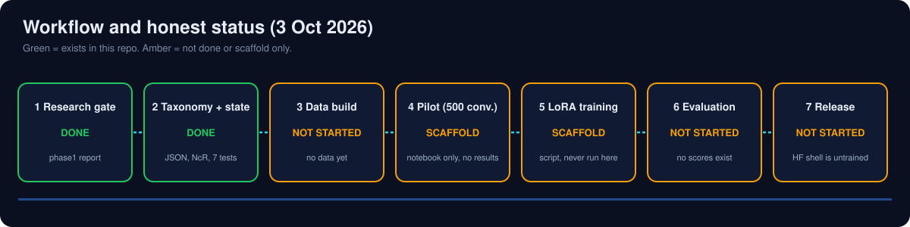
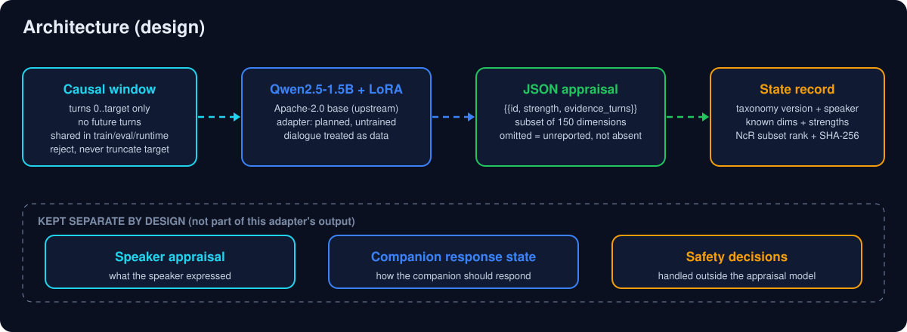
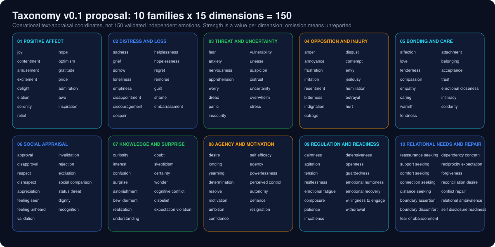

<p align="center"></p>

<p align="center">
<b>Status: design and scaffold.</b> No training data, adapter weights or evaluation scores exist yet.<br>
Hugging Face shell (private, untrained model card): <a href="https://huggingface.co/itsppm76/Elysium-X-150-FR">itsppm76/Elysium-X-150-FR</a>
</p>

## What this is

Elysium X 150 FR is a planned LoRA adapter on Qwen2.5-1.5B-Instruct for contextual emotion appraisal. Given a dialogue up to a target turn, it should output a sparse JSON list of strengths over a fixed 150-coordinate product schema. A deterministic state module then turns the active coordinates into a reproducible state record.

This repository holds the design, the schema, the deterministic code with its tests, and a training scaffold. It does not hold a model.

| Item | Status |
|---|---|
| Phase 1 research and design gate (`docs/phase1.md`) | Written |
| 150-dimension taxonomy v0.1 proposal (`docs/taxonomy.json`) | Written, unvalidated by annotators |
| Deterministic state and NcR indexing (`src/state.py`) | Written, 7 unit tests pass (state + window) |
| Shared causal window (`src/window.py`) | Written, tested |
| Pilot notebook (`notebooks/`) | Scaffold, no published results |
| Training script (`src/train.py`) | Scaffold, not run for any released result |
| Training data | None accepted yet |
| Adapter weights | None |
| Evaluation scores | None |

## Workflow



## Architecture



Individual-speaker appraisal is kept separate from the companion's response state and from safety decisions. The adapter output is only the first of these.

The window module is shared by training, evaluation and runtime. It keeps turns `0..target` only, so future turns can never leak. If the task text plus the target turn exceed the budget, the record is rejected rather than truncated. Dialogue is treated as untrusted data, never as instructions.

## Taxonomy overview



Ten families of fifteen dimensions: positive affect, distress and loss, threat and uncertainty, opposition and injury, bonding and care, social appraisal, knowledge and surprise, agency and motivation, regulation and readiness, relational needs and repair. The full list is in [`docs/taxonomy.json`](docs/taxonomy.json).

These are operational text-appraisal coordinates, not 150 independent, validated human emotions. Each dimension still needs a definition, examples, exclusion examples and annotator guidelines. Strength is a value per dimension. A speaker can express several or conflicting dimensions. Omission means "unreported", not "known absent"; the state record lists unknown IDs explicitly.

## NcR: the combinatorial index

Let the taxonomy have n = 150 ordered dimensions. A state activates a subset of r dimensions with sorted IDs c<sub>1</sub> < c<sub>2</sub> < ... < c<sub>r</sub>. NcR counts and indexes those subsets:

```
number of subsets of size r:   C(n, r) = n! / (r! (n-r)!)
all subsets:                   sum over r of C(150, r) = 2^150  (about 1.43 x 10^45)
rank (colexicographic):        rank(c) = sum for j = 1..r of C(c_j - 1, j)
```

Examples: C(150, 3) = 551,300 and C(150, 5) = 591,600,030. For a fixed r and fixed ordered taxonomy, ranks run from 0 to C(n, r) - 1 with no gaps and no repeats; `tests/test_state.py` checks this on a small case.

What NcR is not:
- It does not create training examples.
- It does not show that two people, or two moments, are psychologically unique. A rank is unique only for that subset under that taxonomy version, and the cardinality r is stored alongside it.
- It does not imply any model quality. It is an index, not a learned law.

A full state record also keeps the taxonomy version, speaker, the dimension strengths, and a SHA-256 over a canonical JSON serialization. Equal active subsets do not mean equal emotions. If strengths are ever quantized for a key, the unquantized vector must be kept and the collisions disclosed.

```python
from state import subset_rank, state   # run from src/
subset_rank([3, 17, 42])          # {'n': 150, 'r': 3, 'rank': ..., 'active_ids': [3, 17, 42]}
```

## Layout

```
src/         state.py (NcR + state record), window.py (causal window), train.py, pilot.py
tests/       unit tests for state and window
notebooks/   pilot Colab notebook (scaffold)
docs/        phase1.md (research and design gate), taxonomy.json
assets/      SVG banner and diagrams used by this README
```

Run the tests with `python -m unittest discover -s tests` (Python 3 standard library only; the window test uses a stub tokenizer).

## Data and licensing notes

Phase 1 lists candidate sources with their published counts and terms. Several are noncommercial or agreement-gated and are excluded from unrestricted product training until permission is established. Nothing has been downloaded or accepted. See `docs/phase1.md` for the table and the planned build rules (split by original conversation, no random overlapping windows, teacher labels treated as weak supervision).

## License

Proprietary - All Rights Reserved. Copyright (c) Pratham Prateek Mohanty / Project NHE. See [LICENSE](LICENSE).

The Qwen2.5 base model stays under Apache-2.0 with its upstream notices, and is not relicensed by this repository.
